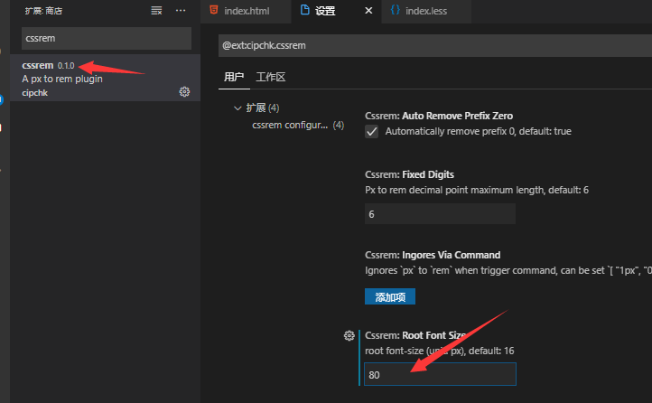
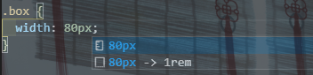
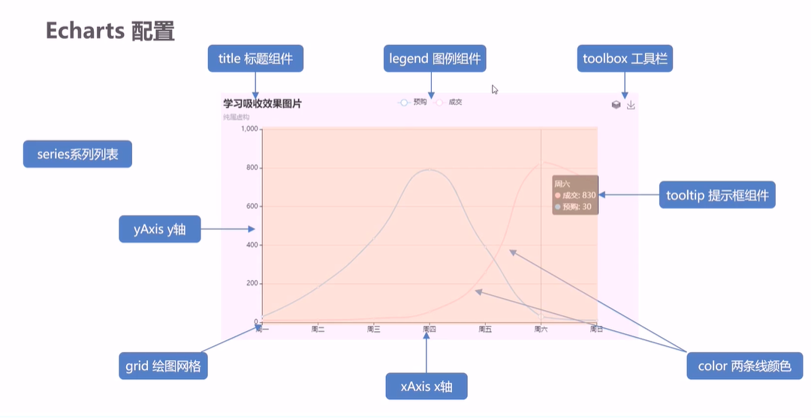

# 数据可视化

## less -> css

在`vscode`里面安装 `esay less` 插件，在保存 `less` 文件的时候就会自动生成 `css` 文件

## 布局适配方案

> `flexible.js`  和 `rem` 进行响应式

### flexible.js 介绍

淘宝做的，能根据屏幕大小修改`html`跟标签的字体大小,

源码:

```js
(function flexible(window, document) {
  var docEl = document.documentElement;
  var dpr = window.devicePixelRatio || 1;

  // adjust body font size
  function setBodyFontSize() {
    if (document.body) {
      document.body.style.fontSize = 12 * dpr + "px";
    } else {
      document.addEventListener("DOMContentLoaded", setBodyFontSize);
    }
  }
  setBodyFontSize();

  // set 1rem = viewWidth / 10
  function setRemUnit() {
    var rem = docEl.clientWidth / 24;
    docEl.style.fontSize = rem + "px";
  }

  setRemUnit();

  // reset rem unit on page resize
  window.addEventListener("resize", setRemUnit);
  window.addEventListener("pageshow", function(e) {
    if (e.persisted) {
      setRemUnit();
    }
  });

  // detect 0.5px supports
  if (dpr >= 2) {
    var fakeBody = document.createElement("body");
    var testElement = document.createElement("div");
    testElement.style.border = ".5px solid transparent";
    fakeBody.appendChild(testElement);
    docEl.appendChild(fakeBody);
    if (testElement.offsetHeight === 1) {
      docEl.classList.add("hairlines");
    }
    docEl.removeChild(fakeBody);
  }
})(window, document);

```

其中重点的就是下面的代码，根据你的设计图吧屏幕划分成多少份。默认是10。

```js
// set 1rem = viewWidth / 10
  function setRemUnit() {
    var rem = docEl.clientWidth / 24;
    docEl.style.fontSize = rem + "px";
  }
```

比如屏幕宽度是 `1920px` 然后现在想分成`24`份，这个时候就会自动设置跟字体大小，使得你的 `1rem = 1920px / 24 = 80px`

### cssrem插件

这个时候 `1rem`是`80px`还是很不好计算。就可以使用 `vscode`的 `cssrem`插件



做出如下配置就可以了，在我们写css样式的时候就有 提示了



> 第一次设置记得重启哦

## 项目初始化

- body 设置背景图 ，缩放为 100%  ， 行高1.15
- css初始化

## 布局

emm,慢慢写样式。

## 图表制作

### 常见的数据可视化库

- D3.js   目前 Web 端评价最高的 Javascript 可视化工具库(入手难)  

- ECharts.js   百度出品的一个开源 Javascript 数据可视化库   

- Highcharts.js  国外的前端数据可视化库，非商用免费，被许多国外大公司所使用  

- AntV  蚂蚁金服全新一代数据可视化解决方案  等等

>  Highcharts 和 Echarts 就像是 Office 和 WPS 的关系

## Echarts

+ 下载并引入
+ 准备一个大小固定的盒子
+ 初始化 echart
+ 指定配置项和数据(option)
+ 将配置项设置给echarts实例对象

### Echarts配置项

> 官网API： https://echarts.apache.org/zh/option.html#title.id 

+ title -- 标题
  + 位子，大小，字体，颜色，副标题，padding，背景，阴影，堆叠层级，对齐方式，点击跳转等等
+ tooltip -- 提示框
  + 类型，触发类型，样式，动画，定位，padding，边框等等
+ legend -- 图例
  + 类型，层级，定位，样式，控制，图标等等
+ toolbox -- 工具箱组件
  +  [导出图片](https://echarts.apache.org/zh/option.html#toolbox.feature.saveAsImage)，[数据视图](https://echarts.apache.org/zh/option.html#toolbox.feature.dataView)，[动态类型切换](https://echarts.apache.org/zh/option.html#toolbox.feature.magicType)，[数据区域缩放](https://echarts.apache.org/zh/option.html#toolbox.feature.dataZoom)，[重置](https://echarts.apache.org/zh/option.html#toolbox.feature.reset)五个工具。 
  + 样式，定位等等
+ grid --  绘图网格 
  + 控制图表大小，宽高，坐标轴，背景色，边框刻度显示等等
+ xAxis / yAxis -- x轴 / y轴  坐标相关
  + 位置，偏移，类型，名称，样式，名称对齐方式旋转角度距离，分隔数，间距，轴线设置，等等
+ `axisLine`轴线 `axisTick`轴刻度 `axisLabel`轴标签
  
+ series -- 系列

+ color -- 设置颜色列表



当然还有很多配置。。。。就是你都能想到的设置，官网肯定都有。

### 例子总结

x轴，y轴可以不显示，也可以用数组配置多个。
反转轴的数据可以直接用 inverse 配置反转

```json
xAxis: { show: false },
yAxis: [{...}, {...}],
```

series配置的就是一系列的数据和展示的样式，柱状图改成圆框可以是没有背景色有边框。

想两个轴重叠在一起就设置一个叫`yAxisIndex`，`xAxisIndex`的属性

> 官方对 `yAxisIndex`解释： 使用的 [y 轴](https://echarts.apache.org/zh/option.html#yAxis)的 index，在单个图表实例中存在多个 y轴的时候有用。 

```json
series: [{
        name: '条',
        type: 'bar',
        data: [70, 34, 60, 78, 69],
        // 柱子设为圆角
        itemStyle: {
          barBorderRadius: 20,
          color: function (seriesIndex) {
            return myColor[seriesIndex.dataIndex]
          }
        },
    //层叠
        yAxisIndex: 0,
      },
      {
        name: '框',
        type: "bar",
       // 圆框
        itemStyle: {
          color: "none",
          borderColor: "#00c1de",
          borderWidth: 3,
          barBorderRadius: 15
        },
        data: [100, 100, 100, 100, 100],
          //层叠
        yAxisIndex: 1
      }
    ]
```

有些参数可以是一个函数

```js
color: function (seriesIndex) {
	return myColor[seriesIndex.dataIndex]
}
```

