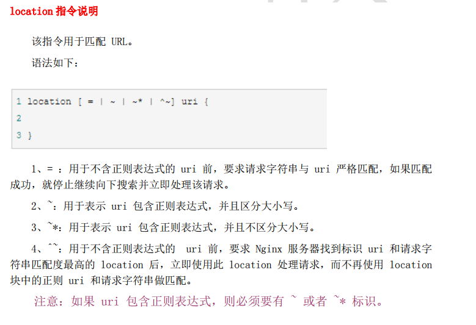
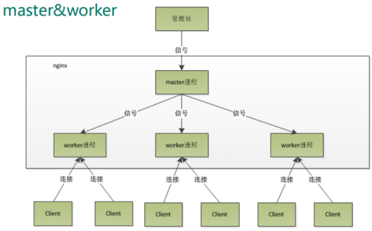
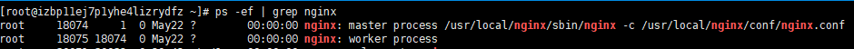
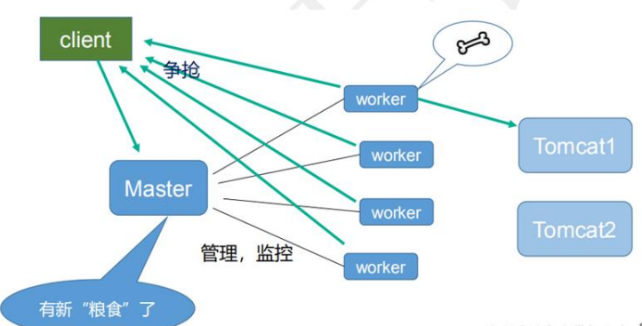

# Nginx学习笔记

## nginx简介

Nginx ("engine x") 是一个高性能的 HTTP 和反向代理服务器,特点是占有内存少，并发能力强，事实上 nginx 的并发能力确实在同类型的网页服务器中表现较好，中国大陆使用 nginx网站用户有：百度、京东、新浪、网易、腾讯、淘宝等

### 正向代理

一开始我们要访问目标服务器，现在目标服务器出了点问题，我们访问不到了，我们就可以**配置一个**代理服务器，通过访问代理服务器，代理服务器在帮助我们访问目标服务器，这就是正向代理

### 反向代理

其实正向代理可以理解成用户因为访问不到要访问的服务器了，自己搭了一个服务器，**通过这个服务器**帮助我们访问我们本来想访问的服务器，比如被墙了，自己搭梯子。

反向代理就是服务器运维人员觉得直接把服务器ip地址暴露出来很危险，运维人员搭了一个代理服务器，暴露代理服务器的ip地址，通过代理服务器来转发到真实的服务器上。所以普通用户访问的是代理服务器，代理服务器帮我们访问真正的服务器。

正向代理对于最终服务器来说，服务器是不知道用户的真实地址的。---隐藏了用户

方向代理对于用户来说，用户是不知道最终服务器的地址的。---隐藏了服务器

### 负载均衡

一开始我们都是，请求服务器，服务器查询数据库，数据库告知结果给服务器，服务器在给我们响应数据。现在请求多了，一台服务器就可能卡死，弄个反向代理服务器，来把我们的请求，分发给多个服务器，做负载均衡。

服务器查询数据库很慢，反向代理服务器查询服务器运载情况快，查询之后把请求发给运载低的服务器。多个服务器干的是同一个事情。

### 动静分离

为了加快网站的解析速度，可以把动态页面和静态页面由不同的服务器来解析，加快解析速度。降低原来单个服务器的压力。


以上四点 `nginx` 都能做

## 安装步骤

先安装一些依赖

第一个是pcre  百度了说这个包是用来解析正则表达式的

```
下载指令
wget http://downloads.sourceforge.net/project/pcre/pcre/8.37/pcre-8.37.tar.gz
解压
tar –xvf pcre-8.37.tar.gz
进入安装目录执行
./configure
然后
make && make install
最后查看版本就算成功了
pcre-config --version
```

然后安装一些环境

```
yum -y install make zlib zlib-devel gcc-c++ libtool openssl openssl-devel
```

上面做完就可以安装nginx

下载安装包

```
下载
wget http://nginx.org/download/nginx-1.15.4.tar.gz
解压
tar –xvf nginx-1.15.4.tar.gz
进入安装目录执行
./configure
然后
make && make install

上面安装完成之后会在 /usr/local 目录下生成 nginx文件夹，这才是真正的目录
```

## nginx常用指令

所有指令都是在 `/usr/local/nginx/sbin` 目录下执行

+ 启动`nginx`

  ```
  在/usr/local/nginx/sbin 目录下执行 ./nginx 
  指令：ps -ef | grep nginx   查看是否启动
  ```

+ 关闭`nginx`

  ```
  在/usr/local/nginx/sbin 目录下执行 ./nginx -s stop 
  ```

+ 重新加载 `nginx`  配置文件

  ```
  在/usr/local/nginx/sbin 目录下执行 ./nginx -s reload
  ```

+ 查看版本

  ```
  在/usr/local/nginx/sbin 目录下执行  ./nginx -v
  nginx version: nginx/1.15.4
  ```

## nginx配置文件

大牛博客：https://blog.csdn.net/wangbin_0729/article/details/82109693

路径：/usr/local/nginx/conf/nginx.conf

安装路径也有配置文件，启动的时候还是使用的 /usr/local/nginx/conf/nginx.conf

最外面的块是main，main包含Events和HTTP，HTTP包含upstream和多个Server，Server又包含多个location：

main（全局设置）、server（主机设置）、upstream（负载均衡服务器设置）和 location（URL匹配特定位置的设置）。

- main块设置的指令将影响其他所有设置；
- server块的指令主要用于指定主机和端口；
- upstream指令主要用于负载均衡，设置一系列的后端服务器；
- location块用于匹配网页位置。

这四者之间的关系式：server继承main，location继承server，upstream既不会继承其他设置也不会被继承。
在这四个部分当中，每个部分都包含若干指令，这些指令主要包含Nginx的主模块指令、事件模块指令、HTTP核心模块指令，同时每个部分还可以使用其他HTTP模块指令，例如Http SSL模块、HttpGzip Static模块和Http Addition模块等。

+ 全局块

  ```
  全局块用来配置服务器整体运行的配置指令
  
  user是个主模块指令，指定Nginx Worker进程运行用户以及用户组，默认由nobody账号运行。
  
  worker_processes是个主模块指令，指定了Nginx要开启的进程数。每个Nginx进程平均耗费10M~12M内存。建议指定和CPU的数量一致即可。
  
  error_log是个主模块指令，用来定义全局错误日志文件。日志输出级别有debug、info、notice、warn、error、crit可供选择，其中，debug输出日志最为最详细，而crit输出日志最少。
  
  pid是个主模块指令，用来指定进程pid的存储文件位置。
  
  worker_rlimit_nofile用于绑定worker进程和CPU， Linux内核2.4以上可用。
  ```

+ events 块

  ```
  events事件指令是设定Nginx的工作模式及连接数上限：
  
  use epoll;
  use是个事件模块指令，用来指定Nginx的工作模式。Nginx支持的工作模式有select、poll、kqueue、epoll、rtsig和/dev/poll。其中select和poll都是标准的工作模式，kqueue和epoll是高效的工作模式，不同的是epoll用在Linux平台上，而kqueue用在BSD系统中。对于Linux系统，epoll工作模式是首选。
  
  worker_connections  1024;  
  worker_connections也是个事件模块指令，用于定义Nginx每个进程的最大连接数，默认是1024。最大客户端连接数由worker_processes和worker_connections决定，即Max_client=worker_processes*worker_connections。
  在作为反向代理时，max_clients变为：max_clients = worker_processes * worker_connections/4。
  ```

+ http 块

  这算是 Nginx 服务器配置中最频繁的部分，代理、缓存和日志定义等绝大多数功能和第三方模块的配置都在这里。

  + 全局快

    ```
    include       mime.types;
    include是个主模块指令，实现对配置文件所包含的文件的设定，可以减少主配置文件的复杂度。类似于Apache中的include方法。
    
    default_type  application/octet-stream;
    default_type属于HTTP核心模块指令，这里设定默认类型为二进制流，也就是当文件类型未定义时使用这种方式，例如在没有配置PHP环境时，Nginx是不予解析的，此时，用浏览器访问PHP文件就会出现下载窗口。
    ```

  + Server

    ```
  server{
        listen 80;
      server_name 192.168.8.18 coderyl.top
        index index.html index.htm index.php;
        root /home/xxx/xxx
        charset gb2312;
        access_log logs/access.log main;
        。。。。
    }
    
    server标志定义虚拟主机开始
    listen用于指定虚拟主机的服务端口
    server_name用来指定IP地址或者域名，多个域名之间用空格分 开。index用于设定访问的默认首页地址
    root指令用于指定虚拟主机的网页根目录，这个目录可以是相对路径，也可以是绝对路径。
    Charset用于 设置网页的默认编码格式。
    access_log用来指定此虚拟主机的访问日志存放路径，最后的main用于指定访问日志的输出格式。
    ```
  
    
  

## 反向代理的配置-案例1

比如tomcat的默认端口是8080，每次访问需要输入 ip:8080，现在想只输入ip就访问到tomcat，就需要配置反向代理

在`server`部分的配置

```
listen 80;
server_name ip地址;
```

在 `serve` 中的`location` 的配置

```
location / {
    root   html;
    index  index.html index.htm;
    proxy_pass http://ip地址:8080/;
}
```

主要是 `proxy_pass` 的配置，会把监听端口的请求，代理发送到配置的路径去

## 反向代理的配置-案例2

实现效果：使用 nginx 反向代理，根据访问的路径跳转到不同端口的服务中
nginx 监听端口为 9001，
访问 http://127.0.0.1:9001/edu/a.html ，访问的路径在包含 edu 直接跳转到 127.0.0.1:8081/a.html
访问 http://127.0.0.1:9001/vod/a.html ，访问的路径在包含 vod 直接跳转到 127.0.0.1:8082/a.html

之间监听了80端口，现在要监听9001端口，可以自己写一份 `server`配置，就是整个配置文件中有两个 `server`

配置如下

```
server {
    listen       9001;
    server_name  127.0.0.1;

    location ~ /edu/ {  # 正则写法
        proxy_pass http://127.0.0.1:8081/;
    }
    
    location ~ /vod/ {  # 正则写法
        proxy_pass http://127.0.0.1:8082/;
    }
}
```

## location指令说明

> 注意 location 匹配的是 uri
>
> 详细说明：https://blog.csdn.net/qq_33862644/article/details/79337348



## 负载均衡的配置

实现效果：浏览器地址栏输入地址 http://192.168.17.129/edu/a.html，负载均衡效果，平均 8080
和 8081 端口中

准备工作：准备两台 tomcat 服务器，一台 8080，一台 8081

配置如下

```
http {
	// 通过upstream 配置 负载均衡 服务器列表
    upstream myserver{  # 名字随便取
        server 192.168.5.21:8080;  # IP对应要负载的服务器 ip 
        server 192.168.5.22:8081;
    }


    server {
        listen 80;  # 要监听80端口
        server_name  127.0.0.1;  # 自己的 ip 
        
        location / {
            root   html;
            index  index.html index.htm;
            proxy_pass http://myserver/;  # http://XXX/   XXX 是upstream 中取的名称
        }
    }
}
```

这个时候基本就配置好了，现在访问  http://192.168.17.129/edu/a.html，就会 根据负载均衡跳到

http://192.168.5.21:8080/edu/a.html或者http://192.168.5.22:8081/edu/a.html

### 负载均衡分配策略

**1、轮询（默认）**
每个请求按时间顺序逐一分配到不同的后端服务器，如果后端服务器 down 掉，能自动剔除。

```
upstream myserver{  
    server 192.168.5.21:8080;
    server 192.168.5.22:8081;
}
```

**2、weight**
weight 代表权,重默认为 1,权重越高被分配的客户端越多，指定轮询几率，weight 和访问比率成正比，用于后端服务器性能不均的情况。

```
upstream myserver{  
    server 192.168.5.21:8080 weight=10;
    server 192.168.5.22:8081 weight=10;
}
```

**3、ip_hash**
每个请求按访问 ip 的 hash 结果分配，这样每个访客固定访问一个后端服务器，可以解决 session 的问题。

```
upstream myserver{  
    ip_hash;
    server 192.168.5.21:8080;
    server 192.168.5.22:8081;
}
```

**4、fair（第三方）**
按后端服务器的响应时间来分配请求，响应时间短的优先分配。

```
upstream myserver{  
    server 192.168.5.21:8080;
    server 192.168.5.22:8081;
    fair;
}
```

## 动静分离的配置

### 简介

把动态请求和静态请求分开处理，不说把动态静态的页面文件分开，简单的例子就是静态请求由nginx处理，动态请求由tomcat处理。实际中我们一般会把静态资源单独放到一个服务器中，然后我们请求静态页面的时候就可以让nginx帮我们指向到这个静态资源服务器。这个时候一个项目，静态资源和动态资源是分开部署的。

### 用到的配置

通过 location 指定不同的后缀名实现不同的请求转发。

通过 expires 参数设置，可以使浏览器缓存过期时间，减少与服务器之前的请求和流量。具体 Expires 定义：是给一个资源设定一个过期时间，也就是说无需去服务端验证，直接通过浏览器自身确认是否过期即可，所以不会产生额外的流量。此种方法非常适合不经常变动的资源。（如果经常更新的文件，不建议使用 Expires 来缓存），我这里设置 3d，表示在这 3 天之内访问这个 URL，发送一个请求，比对服务器该文件最后更新时间没有变化，则不会从服务器抓取，返回状态码 304，如果有修改，则直接从服务器重新下载，返回状态码 200。

### 配置前的准备工作

在服务器的根目录下，弄一个文件夹作为专门存贮静态资源的目录。

例如根目录下新建  data文件夹，在data文件夹内建一个www文件夹，专门来存静态的html文件，在data目录下在新建一个image来存储图片资源

```
目录结构: 其中服务器的data是根目录
|--data
|--|--www
|--|--|--a.html
|--|--image
|--|--|--a.png
```

### `要实现的效果`

### 具体配置

```
server {
    listen 80; # 要监听的端口
    server_name  127.0.0.1; # 自己的ip地址

    location /www/ {  
        root   /data/;
        index  index.html index.htm;
        expires 30d;  # 配置缓存的时间
    }
    
    location /image/ {  
        root   /data/;
        autoindex on;  # 待会详细说
    }
}
```

现在访问 `http:127.0.0.1/image/a.png` ，`http:127.0.0.1/www/a.html`就可以访问到服务器的资源

### autoindex on; 

是否列出文件目录，默认是否

`http:127.0.0.1/image/a.png` 可以访问到文件

`http:127.0.0.1/image`  可以访问到文件夹，看见里面的文件列表

`http:127.0.0.1/www` 是404错误

## 配置高可用的集群

### 高可用的概念

现在我们可以让 nginx 完美的管理我们所有的请求，管理我们所有的服务器，现在就有一个问题，万一哪天，nginx的服务器挂了，那就一切都完蛋了。高可用就是配置多台nginx服务器，其中一台是主服务器（MASTER），其他的是备用服务器（BACKUP），我们用的都是主服务器，当主服务器挂掉之后会自动的切换到备份的服务器。需要用到 keepalived软件。对外提供一个虚拟的ip地址，通过这个虚拟的地址访问主服务器，keepalived会把虚拟地址绑定到主服务器上，每一次访问的时候keepalived会检查这台服务器有没有挂掉，挂掉了就会把这个虚拟的ip绑定到备份的服务器上。

### 高可用配置准备工作

两台服务器，IP分别是 192.168.17.129 和 192.168.17.131

安装 nginx

安装 keepalived

```
安装指令：
yum install keepalived –y
检查是否安装成功
rpm -q -a keepalived
安装成功之后，安装目录
/etc/keepalived
```

keepalived 主服务器配置

```
# 全局定义
global_defs {
   # 这个里面最重要的就是这个 router_id  配置一个标识符
   router_id LVS_DEVEL
}

# 检测 脚本
vrrp_script check {
    script "/usr/local/src/nginx_check.sh"
    interval  10  # 每隔10ms检测脚本是否存活
}

# 虚拟ip 的配置
vrrp_instance VI_1 {
    state MASTER  # 主服务器写 MASTER 备份服务器写 BACKUP
    interface eth0  # 网卡 用 ifconfig 命令查看
    virtual_router_id 51  # 路由值，主备服务器这个值必一致
    priority 100  # 设置一个优先级，一般主机大，备服务器小
    advert_int 1
    authentication {
        auth_type PASS
        auth_pass 1111
    }
    virtual_ipaddress {
        192.168.200.16  # 虚拟的ip地址
    }
}
```

keepalived 备服务器配置

```
修改下面 3 个值就行了
state BACKUP  # 主服务器写 MASTER 备份服务器写 BACKUP
interface eth0  # 网卡 用 ifconfig 命令查看
priority 90  # 设置一个优先级，一般主机大，备服务器小
```

nginx_check.sh  脚本内容

```
#!/bin/bash
A=`ps -C nginx –no-header |wc -l`
if [ $A -eq 0 ];then
    /usr/local/nginx/sbin/nginx
    sleep 2
    if [ `ps -C nginx --no-header |wc -l` -eq 0 ];then
    	killall keepalived
    fi
fi
```

启动两台服务器的keepalived 和 nginx 

```
keepalived  启动命令:
systemctl start keepalived.service
检测有没有启动成功
ps -ef | grep keepalived
```

现在通过 192.168.200.16  这个虚拟的ip地址就可以访问到主服务器了

## nginx原理

### 1、mater 和 worker





### 2、worker 工作方式



一个请求（client）发送过来的时候会先经过master，会通知所有的worker来争抢这个请求，抢到之后再来做请求转发，反向代理等等操作。

### 3、一个 master 和多个 woker 有好处

（1）可以使用 nginx –s reload 热部署，利用 nginx 进行热部署操作。
（2）每个 woker 是独立的进程，如果有其中的一个 woker 出现问题，其他 woker 独立的，继续进行争抢，实现请求过程，不会造成服务中断

### 4、设置多少个 woker 合适

Nginx 同 redis 类似都采用了 io 多路复用机制，每个 worker 都是一个独立的进程，但每个进程里只有一个主线程，通过异步非阻塞的方式来处理请求， 即使是千上万个请求也不在话下。每个 worker 的线程可以把一个 cpu 的性能发挥到极致。所以 **worker 数和服务器的 cpu 数相等是最为适宜的**。设少了会浪费 cpu，设多了会造成 cpu 频繁切换上下文带来的损耗。

### 5、连接数 worker_connection

这个值是表示每个 worker 进程所能建立连接的最大值，所以，一个 nginx 能建立的最大连接数，应该是 worker_connections * worker_processes。当然，这里说的是最大连接数，对于HTTP 请 求 本 地 资 源 来 说 ， 能 够 支 持 的 最 大 并 发 数 量 是 worker_connections * worker_processes，如果是支持 http1.1 的浏览器每次访问要占两个连接，所以普通的静态访问最大并发数是： worker_connections * worker_processes /2，而如果是 HTTP 作 为反向代理来说，最大并发数量应该是 worker_connections * worker_processes/4。因为作为反向代理服务器，每个并发会建立与客户端的连接和与后端服务的连接，会占用两个连接。

请求静态资源的时候，**来一个连接，返回一个连接**，就会占用两个连接。请求动态资源的时候一般会请求数据库等等后端的，所以又会多两个连接，就是四个。

所以最大并发数就是 相乘，除2  或者 除4