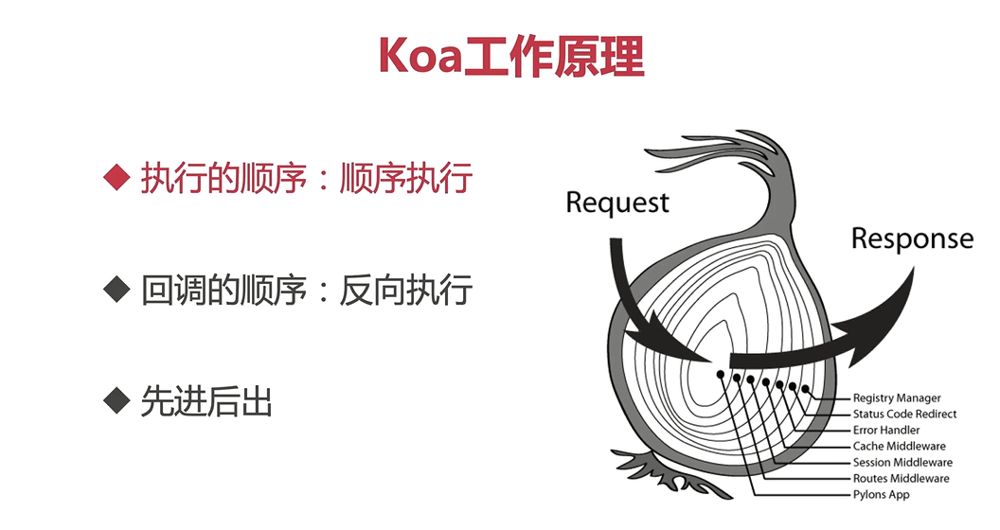

# koa

>  koa 是由 Express 原班人马打造的，致力于成为一个更小、更富有表现力、更健壮的 Web 框架。使用 koa 编写 web 应用，通过组合不同的 generator，可以免除重复繁琐的回调函数嵌套，并极大地提升错误处理的效率。koa 不在内核方法中绑定任何中间件，它仅仅提供了一个轻量优雅的函数库，使得编写 Web 应用变得得心应手。 




### 插件

+ 路由 koa-router 
+ 协议解析 koa-body
+ 跨域处理 @koa/cors
+ 返回格式化 koa-json
+ 路由压缩 koa-combine-routers
+ 静态资源 koa-static

+ 安全 koa-helmet
+ 压缩中间件 koa-compress

### 中间件

```js
const koa = require('koa')
const app = new koa()


const middleware1 = function async (ctx, next) {
  console.log('this is a middleware1 start');
  console.log(ctx.request.path);
  next()
  console.log('this is a middleware1 end');
}
const middleware2 = function async (ctx, next) {
  console.log('this is a middleware2 start');
  console.log(ctx.request.path);
  next()
  console.log('this is a middleware2 end');
}

app.use(middleware1)
app.use(middleware2)

app.listen(3000)
```

### 热加载以及es6支持

modemon 监视实现热加载

```js
npm i -D nodemon
npx nodemon src/index.js
```

webpack实现es6支持

```js
npm install -D webpack webpack-cli
npm install -D clean-webpack-plugin webpack-node-externals @babel/core @babel/node @babel/preset-env babel-loader cross-env
```

+ webpack.config.js

```js
const path = require('path')
var nodeExternals = require('webpack-node-externals')
const { CleanWebpackPlugin } = require('clean-webpack-plugin')

const webpackconfig = {
  target: 'node',
  mode: 'development',
  entry: {
    server: path.join(__dirname, 'src/index.js'),
  },
  devtool: 'eval-source-map',
  output: {
    filename: '[name].bundle.js',
    path: path.join(__dirname, './dist'),
  },
  module: {
    rules: [
      {
        test: /\/(js|jsx)$/,
        use: {
          loader: 'babel-loader',
        },
        exclude: [path.join(__dirname, '/node_modules')],
      },
    ],
  },
  externals: [nodeExternals()],
  plugins: [new CleanWebpackPlugin()],
  node: {
    console: true,
    global: true,
    process: true,
    Buffer: true,
    __filename: true,
    __dirname: true,
    setImmediate: true,
    path: true,
  },
}
module.exports = webpackconfig
```

+ .babelrc

```js
{
  "presets": [
    [
      "@babel/preset-env",
      {
        "targets": {
          "node": "current"
        }
      }
    ]
  ]
}
```

```js
// 打包指令
npx webpack

// es6 指令支持运行
npx babel-node src/index.js

// 热部署和es6
npx nodemon --exec babel-node src/index.js
```

### 工程优化

+ 依赖包版本追踪

npm-check-updates

```js
// 安装
npm install npm-check-updates -g
// 检查并且更新 package.js版本
ncu -u
// 删除原来的依赖包
rm -rf node_modules
// 重新安装
npm install
```

+ koa插件太多了----整合插件包

```js
// 安装
npm i koa-compose

// app.use(helmet())
// app.use(statics(path.join(__dirname, '../public')))
// app.use(router())

// compose整合中间件
const middleware = compose([
  koaBody(),
  statics(path.join(__dirname, '../public')),
  cors(),
  jsonutil({ pretty: false, param: 'pretty' }),
  helmet(),
])
app.use(middleware)
app.use(router())
```

+ webpack 配置整合  webpack-merge

