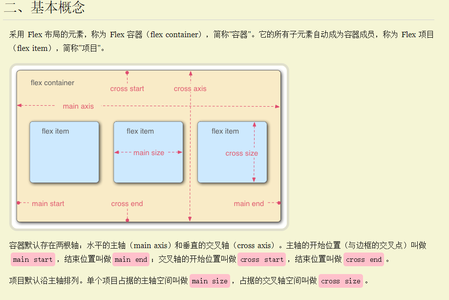

# flex

> 来自阮一峰教程
>
> 语法介绍：http://www.ruanyifeng.com/blog/2015/07/flex-grammar.html
>
> 实例：http://www.ruanyifeng.com/blog/2015/07/flex-examples.html

## 基本概念


## 容器的属性

### 修改主轴方向


### 修改项目排列方式


###  flex-flow

```
flex-flow属性是flex-direction属性和flex-wrap属性的简写形式，默认值为row nowrap。

.box {
  flex-flow: <flex-direction> || <flex-wrap>;
}
```

### 修改主轴上的对齐方式


### 修改交叉轴对齐方式


### 修改多轴线对齐方式

> 容器有多行的时候才会起作用


## 项目的属性

### 修改项目的排列顺序


### 修改项目的大小

> flex-shrink/flex-grow是设置一个比例值，flex-basis是设置一个具体值


### 修改项目的对齐方式

