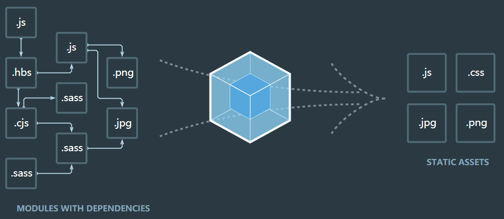

# 前端工程化

### 概念

> 前端工程化是指将前端开发的流程 规范化、标准化，包括开发流程、技术选型、代码规范、构建发布 等,用于
> 提升前端程师的`开发效率`和`代码质量`。

### 为什么要工程化

+ 复杂度高:前端项目的多功能、多页面、多状态、多系统
+ 规模大:团队开发，多人协作,代码质量管理
+ 要求高:页面性能优化( CDN/异步加载/请求合并),CSS兼容性、单页面应用、服务端渲染...

### webpack



#### 核心概念

+ 入口

指定开始扫描的文件，用`entry`配置，默认是  `./src` 

```js
module.exports = {
  entry: './path/to/my/entry/file.js'
};
```

+ 出口

打包过后文件输出的地方，用`output`配置，默认是`. /dist`

```js
const path = require('path');

module.exports = {
  entry: './path/to/my/entry/file.js',
  output: {
    path: path.resolve(__dirname, 'dist'),
    filename: 'my-first-webpack.bundle.js'
  }
};
```

+ loader

`loader` 让 `webpack` 能够去处理那些非 `JavaScript` 文件（`webpack` 自身只理解 `JavaScript`）。 

1. `test` 属性，用于标识出应该被对应的 `loader` 进行转换的某个或某些文件。
2. `use` 属性，表示进行转换时，应该使用哪个 `loader`。

```js
const path = require('path');

const config = {
  output: {
    filename: 'my-first-webpack.bundle.js'
  },
  module: {
    rules: [
      { test: /\.txt$/, use: 'raw-loader' }
    ]
  }
};

module.exports = config;
```

+ 插件(plugins)

loader 被用于转换某些类型的模块，而插件则可以用于执行范围更广的任务。插件的范围包括，从打包优化和压缩，一直到重新定义环境中的变量。[插件接口](https://www.webpackjs.com/api/plugins)功能极其强大，可以用来处理各种各样的任务。

想要使用一个插件，你只需要 `require()` 它，然后把它添加到 `plugins` 数组中。多数插件可以通过选项(option)自定义。你也可以在一个配置文件中因为不同目的而多次使用同一个插件，这时需要通过使用 `new` 操作符来创建它的一个实例。

```javascript
const HtmlWebpackPlugin = require('html-webpack-plugin'); // 通过 npm 安装
const webpack = require('webpack'); // 用于访问内置插件

const config = {
  module: {
    rules: [
      { test: /\.txt$/, use: 'raw-loader' }
    ]
  },
  plugins: [
    new HtmlWebpackPlugin({template: './src/index.html'})
  ]
};

module.exports = config;
```

+ 模式

通过选择 `development` 或 `production` 之中的一个，来设置 `mode` 参数，你可以启用相应模式下的 webpack 内置的优化

```javascript
module.exports = {
  mode: 'production'
};
```

#### 安装和使用

+ 初始化项目

`npm init -y`快速创建`nodejs`项目

+ nvm, node, npm环境确认

`nvm install/use v10.16.0, node.-V, npm -V`

+ 两种webpack安装与三种使用方式

`npm install -g/-D webpack webpack-cli`-g全局安装  -D局部安装

`npx webpack`  新版本推出的 npx指令

`./node_modules/.bin/webpack`  执行对应的二进制文件

`npm run`  在 package.json 中配置 `scripts.build` 并运行

#### 配置文件

文件名称 `webpack.config.js`

配置完成之后要用上面的三个指令中的一个执行 `webpack`

+ 配置输入输出

```js
const path = require('path');

const config = {
  entry: "./src/index.js", // 配置入口文件
  output: { // 配置输出
    path: path.join(__dirname, 'dist1'), // 输出路径
    filename: 'bundle.js' // 输出文件名称
  }
}

module.exports = config
```

+ loader

test去匹配文件、loader倒序加载流水线处理

+ plugins

安装plugin的依赖,在plugins属性中new个plugin

+ webpack-dev-server

引用HMR插件,修改js的时候,自动刷新页面，热部署

+ 模式

`development`开发环境 和 `production`生产环境

```js
if (process.env.NODE_ENV === "production") {
  console.log("production")
}
if (process.env.NODE_ENV === "development") {
  console.log("development")
}
```

#### 总结

一般的 框架的`cli`中会集成配置好的 `webpack`，我们需要能大致了解看懂他们干了啥

### gulp

+ 创建任务

+ 管道写法

+ 处理文件

+ 监听热部署

### 脚手架

学习了gulp和webpack，我们不可能总是每次开始前自己写一大推代码在进行业务代码编写，所以就需要用到脚手架构建项目。

 https://github.com/yeoman/generator-generator 

 https://yeoman.io/authoring/ 

