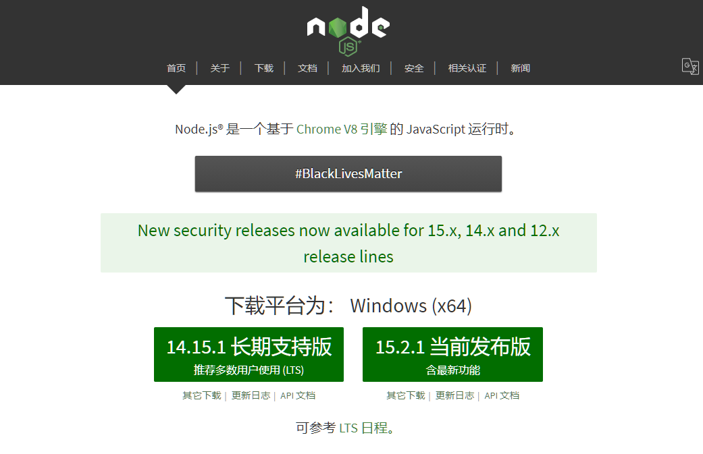
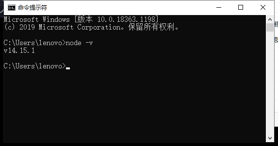
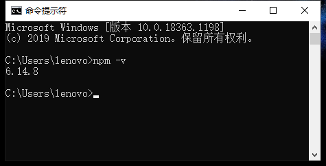
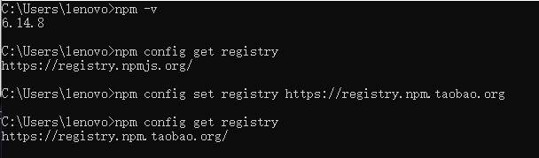
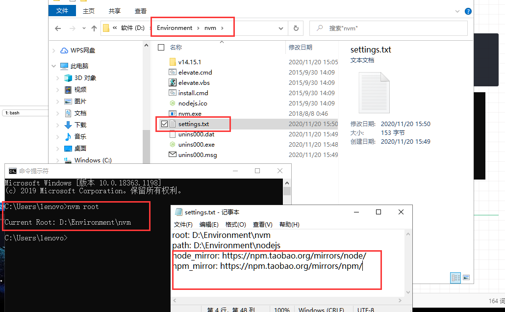

# node

## node 下载安装

官网：https://nodejs.org/zh-cn/



会根据系统自动推送相对应系统的安装包

左边是稳定版，右边是最新发布的，推荐稳定版

安装的时候看得懂的设置一下，看不懂的就默认点next就好了。

然后cmd查看环境   node -v



## npm 配置源



安装好node 就会直接安装了 npm

主要是npm的下载源是国外的，需要设置国内源

```js
// 查看当前源
npm config get registry
// 设置源
npm config set registry https://registry.npm.taobao.org
```



## nvm

官网地址：https://github.com/coreybutler/nvm-windows/releases

安装包解压安装就好了

同理设置nvm的国内源

```js
// 查看nvm的安装目录
nvm root
// 找到 settings.txt  加入下面两行
node_mirror: https://npm.taobao.org/mirrors/node/
npm_mirror: https://npm.taobao.org/mirrors/npm/

// 这个镜像是你用  nvm安装 node 和 npm的镜像
// 不是用 npm安装 包的镜像 npm下载慢还是要设置npm的国内源
```

